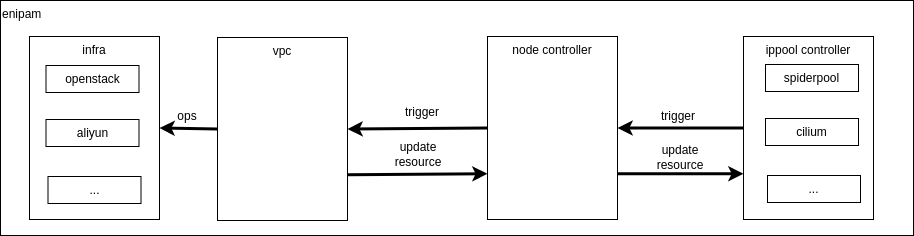

# Enipam

[**English**](./README-en.md) | **简体中文**

Enipam 是用于 vpc 网络管理

## 介绍

专注于 kubernetes 下使用 vpc 的网络解决方案，提供 IPAM 能力，并适配多种 IaaS/ippool 资源.

主要特性
- 协调 IaaS 中网络相关资源和 Ippool 资源
- 非 cni 插件

## 架构

